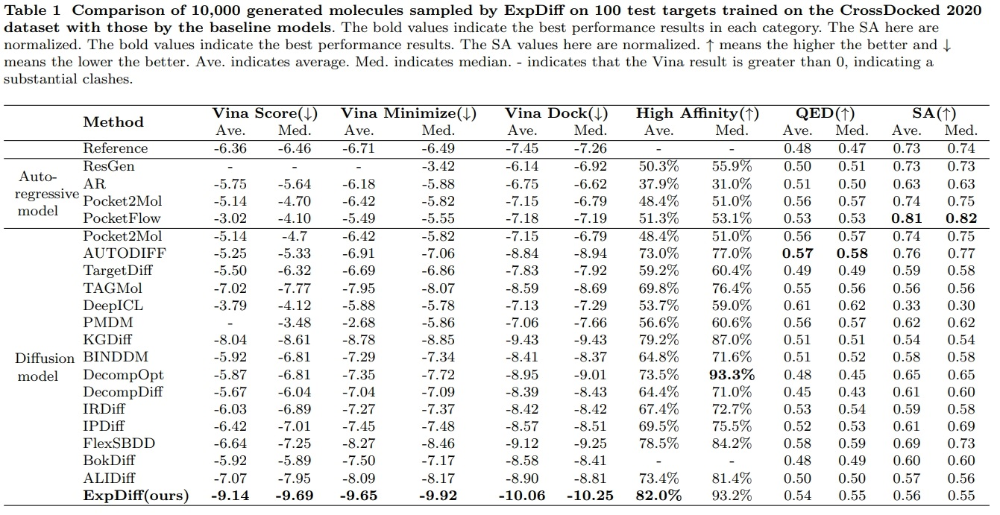

# ExpDiff
## :rocket:A Feature-aligned Diffusion Model for Controllable Generation of 3D Drug-like Molecules
[](https://www.python.org/downloads/) [](https://pytorch.org/)


## 1. Overview
This work focuses on *de novo* structure-based drug design and introduces an expert alignment strategy to address noise-induced instability in diffusion models. We propose a diffusion model called **ExpDiff**, and the experiments proved that the average molecular docking affinity of generated molecules reaches **-10.06 kcal/mol**, and showed drug like properties, as well as the rationality of the structure.


### Dependency:
Follow the below steps for main dependency installation:
```
conda create -y -n ExpDiff tqdm
conda activate DMDiff
conda install pytorch==1.11.0 torchvision==0.12.0 torchaudio==0.10.0 -c pytorch
conda install -y rdkit -c conda-forge
conda install vina
```

or Install based on the **environment.yml**

### Dataset:
Download the Crossdocked2020 dataset from :point_right:[here](https://drive.google.com/file/d/1XMVb4UH4atvLtWRIVtJct9ZqYkBvCze6/view?usp=drive_link)

### AutoDock Vina:
You need to install the AutoDock Vina-related packages and format conversion tools. Please refer to this.

```
conda install -c conda-forge openbabel
pip install meeko==0.1.dev3 vina==1.2.2 pdb2pqr rdkit

# install autodocktools
# for linux
python -m pip install git+https://github.com/Valdes-Tresanco-MS/AutoDockTools_py3
pip install scipy==1.7.3
```
## 2. Usage
One can specify the protein pocket you are interested in as well as the reference molecule when you generate the molecule using the following script.

```
python scripts/sample_from_complex.py
 --protein_root ./test_complex/other_pdb/
 --protein_fn 5liu_X_rec.pdb
 --ligand_fn 5liu_X_rec_4gq0_qap_lig_tt_min_0.sdf
```

## 3. Reproduce our results

```
root/
├── data/
│   ├── test_set/
│   ├── crossdocked_v1.1_rmsd1.0_pocket10_processed_final.lmdb
│   ├── crossdocked_pocket10_pose_split.pt
│   └── ligand_embedding.pt
├── logs/
│   └── 762000.pt
├── models/
│   └── ...
├── ...
│   └── ...
└── utils/
```


### 3.1 Sample:
To replicate our results, download the pre-trained checkpoints from :point_right:[here](https://drive.google.com/drive/folders/1GvoaGc8QrB80nPRXBbuyg4hZpCHcW4Kq?usp=drive_link).

The following are the sample command.

```
python scripts/sample_diffusion.py --config ./configs/sampling.yml
```
Note, sampling with a single GPU would be time-consuming.


### 3.2 Evaluate and dock:
One can dock the generated molecule using the following command, taking care to install Auto Dock Vina and the related dependencies.

```
python scripts/evaluate_diffusion.py
```


The result for **ExpDiff(ours)** can be found :point_right:[here](https://drive.google.com/drive/folders/1tq2gBbWjpeNNlScJIy0LN1vG9EC-xFWb?usp=drive_link).  
 [PMDM (Nat. Commun 2024)](https://www.nature.com/articles/s41467-024-46569-1), [ResGen (Nat. Mach. Intell. 2023)](https://www.nature.com/articles/s42256-023-00712-7), [PocketFlow (Nat. Mach. Intell. 2024)](https://www.nature.com/articles/s42256-024-00808-8),  [DeepICL(Nat. Commun 2024)](https://www.nature.com/articles/s41467-024-47011-2) sampled sdf files and the docking result can be found :point_right:[here](https://drive.google.com/drive/folders/1Pjeq2zLuSU14WzUmEzsC0gIoPH1dbCSG?usp=drive_link). 
Performance of ExpDiff on corssdocked 2020 dataset compared to existing structure-based 3D molecule generation methods:




## 4. Train your own model

### Train:
One can specify different model and training configurations in `train.yml`. The following are the training command.

```
python scripts/train_diffusion.py
```


## 5. Citation

  

```latex

@article{lu2025ExpDiff,

title={A Feature-aligned Diffusion Model for Controllable Generation of 3D Drug-like Molecules},

author={Hao Lu, Xiancong Hou, Wenzheng Han, Hao Liu, Zhiqiang Wei, Yang Zhang},

journal={},

year={2025}

}

```

Node: 
Our code was developed with reference to the code written by [Guan et al.](https://openreview.net/pdf?id=kJqXEPXMsE0), [Qian et al.](https://academic.oup.com/bib/article/25/1/bbad435/7457350) and we would like to express our gratitude to them. :+1::+1:
If you have any questions, feel free to contact Hao Lu, luhao@stu.ouc.edu.cn :heart::heart:
